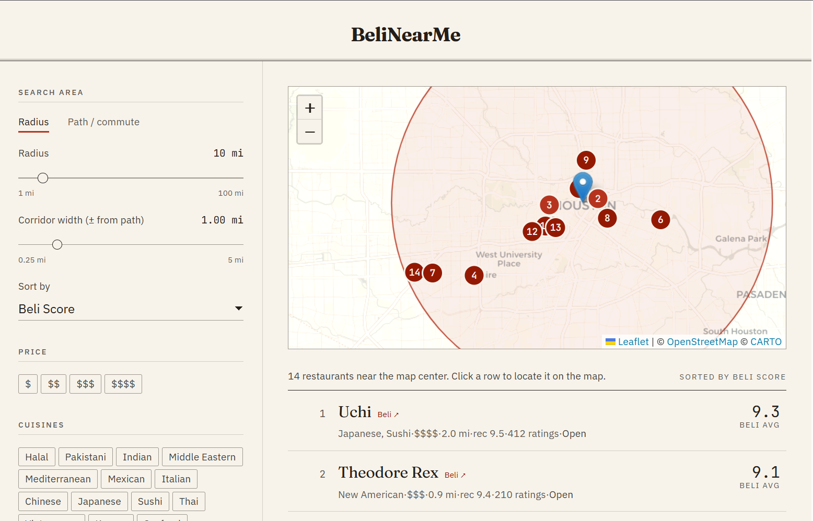

# BeliNearMe

<p align="center">
  
  <br>
  <em>Top restaurants in a 10 mi radius of downtown Houston</em>
</p>

`beli_metadata_api` is a Python FastAPI service that wraps the Beli endpoints we reverse engineered during analysis and turns them into a cleaner local API for:

- nearby restaurant discovery
- score-ranked recommendations
- metadata-first cuisine filtering
- exact-radius filtering
- dietary restriction metadata inspection

## What This Service Solves

The Beli app has multiple search and recommendation paths:

- `GET /api/search-app/` is useful for term-based discovery and metadata hints such as `Halal`, `Vegan`, `Kosher`, and `Gluten Free`
- `GET /api/search-businesses-full/` returns richer prediction rows
- `POST /api/user-rec-scores/` is the important endpoint for nearby recommendations ranked by a sort method such as `Score`

There are two problems if you try to consume those endpoints directly:

1. There is no true circle-radius parameter.
   Beli uses rectangular `bounds`, not a literal `radius`.
2. A score-sorted request with only `coords` is not enough.
   Without `bounds`, `sort_method: "Score"` can return global results instead of local ones.

This service fixes both by:

- converting a center point and mile radius into Beli-compatible `bounds`
- calling `user-rec-scores` with `sort_method="Score"`
- applying an exact-radius post-filter on `distance_mi`
- optionally adding metadata filters like `CUISINE = Halal`

## Reverse-Engineered Endpoint Mapping

These are the Beli endpoints the service depends on:

- `POST /api/token/` (login: `email` + `password` → `access` + `refresh`)
- `POST /api/token/refresh/`
- `GET /api/search-app/`
- `GET /api/search-businesses-full/`
- `POST /api/user-rec-scores/`
- `POST /api/filter-options/?user=<id>&list=PLAYLISTS&category=RES`
- `GET /api/dietary-restriction-options/`

Important findings from the reverse engineering:

- `user-rec-scores` is the real recommendations endpoint behind nearby score-ranked discovery
- `coords` alone does not properly constrain score-ranked results
- `bounds` is required for local score ranking
- `filter-options` can reveal available metadata values inside the returned result set
- `token/` is gated and only responds when the request carries the `X-Requested-With: com.beliapp.myapp` header
- `CUISINE = Halal` works as a real metadata filter in recommendations
- `OPEN_NOW = true` also works as a backend filter

## Project Layout

```text
beli_metadata_api/
  app/
    __init__.py
    client.py
    config.py
    geo.py
    main.py
    models.py
    service.py
  docs/
    API_REFERENCE.md
    IMPLEMENTATION_NOTES.md
  tests/
    test_geo.py
  .env.example
  requirements.txt
  README.md
```

## Requirements

- Python 3.10+
- a valid Beli `refresh` token
- your Beli `user` UUID

## Setup

```bash
python -m venv .venv
.venv\Scripts\activate
pip install -r requirements.txt
copy .env.example .env
```

Fill in:

- `BELI_USER_ID`
- `BELI_REFRESH_TOKEN`

Optional:

- `BELI_API_BASE`
- `BELI_REQUEST_TIMEOUT_SECONDS`

## Refreshing The Token

The Beli **refresh token has a ~7 day lifetime** (`iat` to `exp` is exactly
`604800` seconds). The service uses it to mint short-lived access tokens on
demand, but a refresh token cannot refresh itself: once it expires,
`POST /api/token/refresh/` starts returning `403` and every request fails.

When that happens you have to log in again to mint a new pair. A helper script
does this for you:

```bash
python -m scripts.login
```

Credentials are resolved in this order: shell environment
(`BELI_EMAIL` / `BELI_PASSWORD`), then `.env`, then an interactive prompt
(password input is hidden via `getpass`). The script calls `POST /api/token/`
and writes the new `BELI_REFRESH_TOKEN` back into `.env`.

So if you keep `BELI_EMAIL` and `BELI_PASSWORD` in `.env`, the no-argument
command above is enough.

The API also prints a startup warning if the refresh token is already expired
or will expire within 24 hours, telling you to run the login script. To run it non-interactively without storing a
password in `.env`, provide credentials via the environment instead:

```bash
$env:BELI_EMAIL = "you@example.com"
$env:BELI_PASSWORD = "..."
python -m scripts.login
```

Notes:

- The login endpoint is `POST /api/token/` and only responds when the request
  carries the `X-Requested-With: com.beliapp.myapp` header (handled by the
  helper). A missing or wrong password comes back as
  `No active account found with the given credentials`.
- Treat your Beli password and the resulting refresh token like secrets. Do not
  commit `.env`.
- If you would rather not store a password, grab a fresh `refresh` value from
  the Beli app/web network traffic and paste it directly into `.env`.

## Running The API

```bash
uvicorn app.main:app --reload --app-dir .
```

Interactive docs will be available at:

- `http://127.0.0.1:8000/docs`
- `http://127.0.0.1:8000/redoc`

If you are relying on `.env` instead of shell-level environment variables, start it like this:

```bash
uvicorn app.main:app --reload --app-dir . --env-file .env
```

## Core Behavior

### 1. Nearby recommendations

Endpoint:

- `POST /v1/recommendations/nearby`

This is the generic endpoint for “restaurants near me ranked by score”.

Input:

- a center point
- a radius in miles
- an optional city filter
- optional cuisine filters
- optional `open_now`
- optional raw Beli filters

Internally it:

1. converts the requested radius into a rectangular bounding box
2. sends that `bounds` box to Beli
3. sorts by the requested sort method
4. post-filters each restaurant by exact great-circle distance
5. deduplicates duplicate businesses

### 2. Halal nearby

Endpoint:

- `POST /v1/recommendations/halal-nearby`

This is a convenience wrapper around the nearby recommendations endpoint. It forcibly appends:

```json
{ "key": "CUISINE", "value": ["Halal"] }
```

That is materially different from text-searching `"Halal"` in the app search box. This endpoint uses metadata filtering, not just visible text matching.

### 3. Search endpoints

Endpoints:

- `POST /v1/search/app`
- `POST /v1/search/businesses-full`

Use these when you want to inspect the term-based search behavior separately from recommendation ranking.

### 4. Dietary restriction options

Endpoint:

- `GET /v1/metadata/dietary-restrictions`

This exposes the dietary taxonomy returned by Beli’s backend, which is useful for product work and backend validation.

## Example Requests

### Nearby restaurants in Houston ranked by score

```bash
curl -X POST http://127.0.0.1:8000/v1/recommendations/nearby ^
  -H "Content-Type: application/json" ^
  -d "{\
    \"location\": {\"latitude\": 29.7604, \"longitude\": -95.3698},\
    \"radius_miles\": 10,\
    \"city\": \"Houston, TX\",\
    \"sort_method\": \"Score\",\
    \"exact_radius_only\": true\
  }"
```

### Halal restaurants in Houston within 10 miles ranked by score

```bash
curl -X POST http://127.0.0.1:8000/v1/recommendations/halal-nearby ^
  -H "Content-Type: application/json" ^
  -d "{\
    \"location\": {\"latitude\": 29.7604, \"longitude\": -95.3698},\
    \"radius_miles\": 10,\
    \"city\": \"Houston, TX\",\
    \"sort_method\": \"Score\"\
  }"
```

### Halal and open now

```bash
curl -X POST http://127.0.0.1:8000/v1/recommendations/halal-nearby ^
  -H "Content-Type: application/json" ^
  -d "{\
    \"location\": {\"latitude\": 29.7604, \"longitude\": -95.3698},\
    \"radius_miles\": 10,\
    \"city\": \"Houston, TX\",\
    \"sort_method\": \"Score\",\
    \"open_now\": true\
  }"
```

### Generic metadata-driven cuisine discovery

```bash
curl -X POST http://127.0.0.1:8000/v1/recommendations/nearby ^
  -H "Content-Type: application/json" ^
  -d "{\
    \"location\": {\"latitude\": 29.7604, \"longitude\": -95.3698},\
    \"radius_miles\": 10,\
    \"city\": \"Houston, TX\",\
    \"sort_method\": \"Score\",\
    \"cuisines\": [\"Kosher\", \"Middle Eastern\"]\
  }"
```

### Search-app metadata hints

```bash
curl -X POST http://127.0.0.1:8000/v1/search/app ^
  -H "Content-Type: application/json" ^
  -d "{\
    \"term\": \"Halal\",\
    \"location\": {\"latitude\": 29.7604, \"longitude\": -95.3698},\
    \"city\": \"Houston, TX\"\
  }"
```

## Response Shape

The normalized nearby recommendation response returns:

- `source_endpoint`
- `request_summary`
- `returned_count`
- `exact_radius_count`
- `results`
- `filter_options`

Each `result` includes:

- `business`
- `score`
- `recommendation_score`
- `average_beli_score`
- `distance_mi`
- `within_radius`
- `mention_count`
- `raw`

`score` is kept for backward compatibility and currently mirrors `recommendation_score`, which is the query-specific ranking value returned by `user-rec-scores`.

`average_beli_score` is fetched separately from Beli's business float endpoint using:

- `GET /api/databusinessfloat-sparse/?business=<id>&field__name=AVGBUSINESSSCORE`

That is the score family shown on the Beli business page as the average user score, and it should not be confused with the nearby ranking score.

`raw` is intentionally preserved because reverse-engineered APIs are unstable. If Beli changes fields, this gives you a way to inspect deltas without immediately blocking on a model rewrite.

## Testing

```bash
python -m unittest discover -s tests
